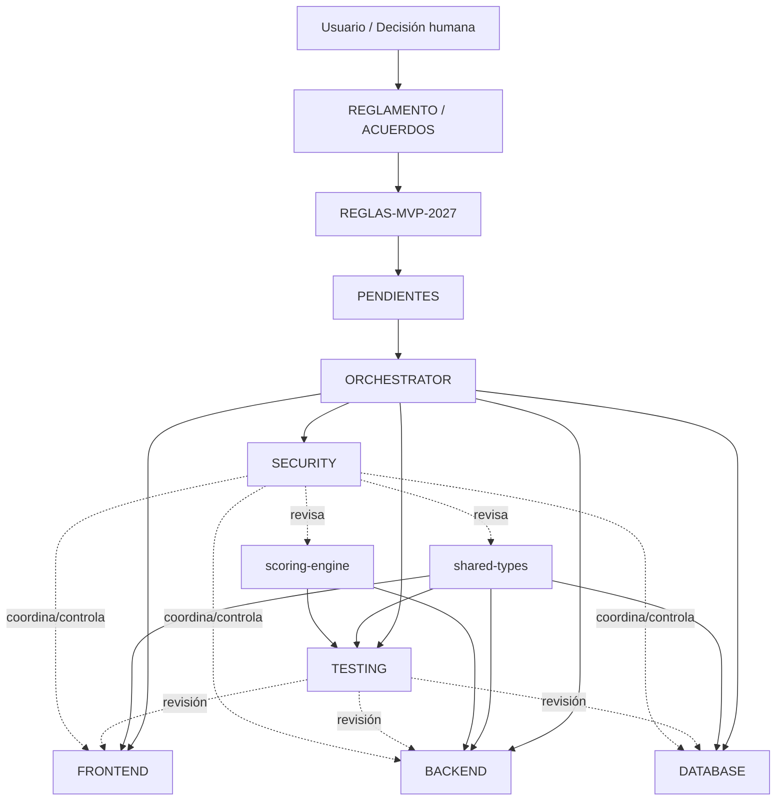

# ARQUITECTURA DE AGENTES — VOTACIONES2027

**Estado:** DISEÑO FORMAL (HITO 2.1.8)
**Finalidad:** Organizar el trabajo futuro de OpenCode sobre el sistema de
Votación Digital para Comparsas de Carnaval Goya 2027.

Este documento define **la arquitectura de agentes** del proyecto. Es
exclusivamente de diseño y documentación: no crea ni configura agentes de
OpenCode, no crea subagentes y no modifica código, contratos ni reglas de
negocio.

---

## 1. Principio fundamental

La arquitectura de agentes respeta la siguiente separación:

```text
REGLAMENTO / ACUERDOS
        ↓
REGLAS-MVP-2027.md
        ↓
PENDIENTES.md
        ↓
AGENTS.md
        ↓
ARQUITECTURA DE AGENTES
        ↓
AGENTES
        ↓
CÓDIGO / TESTS
```

Los agentes son **ejecutores técnicos coordinados**. No son autoridad sobre las
reglas de negocio. Ningún agente puede modificar una decisión funcional para
hacer posible una implementación.

---

## 2. Agentes principales

La arquitectura contempla exactamente estos cinco especialistas más el
Orchestrator:

```text
ORCHESTRATOR
├── BACKEND
├── FRONTEND
├── DATABASE
├── TESTING
└── SECURITY
```

Security es una responsabilidad técnica transversal que coordina controles de
seguridad con los demás especialistas, sin adquirir autoridad sobre las reglas
de negocio.

No se agregan otros agentes principales adicionales a estos seis roles.

---

## 3. Orchestrator

Agente coordinador principal.

### Responsabilidades

- Recibir solicitudes.
- Interpretar el alcance técnico de una tarea.
- Verificar las fuentes de verdad.
- Identificar dependencias.
- Identificar qué especialistas son necesarios.
- Delegar trabajo.
- Controlar el alcance.
- Coordinar cambios transversales.
- Verificar resultados.
- Solicitar validaciones.
- Consolidar reportes.
- Detectar contradicciones.
- Detener trabajos cuando exista una decisión humana pendiente.

### NO puede

- Decidir reglas de negocio.
- Cerrar `PEND-*`.
- Reinterpretar el Reglamento.
- Inventar desempates.
- Modificar `REGLAS-MVP-2027.md` para justificar una implementación.
- Convertir una hipótesis en una decisión.
- Aprobar unilateralmente una decisión arquitectónica material que requiera
  criterio humano.

Tiene mayor **visibilidad**, no mayor autoridad sobre el dominio.

---

## 4. Backend

**Contexto:** `apps/api/`

**Responsabilidades:** API, lógica de aplicación, validación de entradas,
integración con contratos, integración con persistencia, integración con
`scoring-engine` cuando corresponda, autenticación/autorización, operaciones de
dominio ya definidas, auditoría, sincronización del lado servidor y pruebas
correspondientes.

**Respetar:** `apps/api/AGENTS.md`, `packages/shared-types/`,
`packages/scoring-engine/`, `docs/product/**`, `docs/architecture/**`.

No puede redefinir reglas de negocio ni crear contratos incompatibles
unilateralmente.

---

## 5. Frontend

**Contexto:** `apps/client/`

**Responsabilidades:** interfaz PWA, UX, UI, responsive, interacción táctil,
flujo de jurados, flujo de veedor, flujo administrativo, estado de conexión,
persistencia local, sincronización cliente-servidor, confirmaciones anti-error y
visualización de estados.

**Respetar:** `apps/client/AGENTS.md`, `packages/shared-types/`,
`docs/product/**`, `docs/architecture/**`.

No puede duplicar ni reinterpretar reglas de negocio en componentes de UI.

---

## 6. Database

**Contexto:** `database/`

**Responsabilidades:** esquema PostgreSQL, migraciones, integridad referencial,
constraints, índices, persistencia, transacciones, auditoría y soporte de
idempotencia cuando corresponda.

**Respetar:** `database/AGENTS.md`, `docs/product/**`, `docs/architecture/**`,
`packages/shared-types/`.

No puede introducir reglas de negocio nuevas únicamente mediante constraints,
triggers o estructura de datos. Los cambios destructivos requieren autorización
explícita.

---

## 7. Testing

**Contexto:** `tests/`

**Responsabilidades:** estrategia de pruebas, integración, E2E, regresión,
escenarios críticos y validación transversal.

Puede revisar el trabajo de todos los especialistas. Especial atención a: votos,
confirmación, inmutabilidad, offline, sincronización, idempotencia,
penalizaciones, escrutinio, desempates, auditoría y autorización.

Testing **no** debe modificar una regla funcional simplemente para conseguir que
una prueba pase.

---

## 8. Security

**Ámbito:** transversal.

Security es un agente especializado en **seguridad técnica transversal**. No
constituye una nota marginal en la arquitectura: es parte formal del conjunto de
agentes. Coordina controles técnicos de seguridad con Backend, Frontend,
Database y Testing, pero **no adquiere autoridad sobre las reglas de negocio**.

### Responsable de

- autenticación;
- autorización y control de acceso;
- mínimo privilegio;
- protección de sesiones;
- protección de secretos y credenciales;
- seguridad de API;
- validación de superficies de entrada desde la perspectiva de seguridad;
- protección contra replay y abuso de operaciones;
- seguridad de los mecanismos offline/sincronización;
- protección contra manipulación del cliente;
- protección de votos desde la perspectiva de seguridad;
- revisión de mecanismos de inmutabilidad;
- seguridad de la auditoría;
- revisión de dependencias y configuración;
- modelado de amenazas;
- identificación y mitigación de riesgos técnicos de seguridad;
- coordinación de controles de seguridad con Backend, Frontend, Database y
  Testing.

### NO responsable de

- definir reglas de puntuación;
- definir penalizaciones;
- definir desempates;
- definir rubros;
- definir candidatos;
- decidir reglas del Reglamento;
- cerrar `PEND-*`;
- reemplazar a Backend;
- reemplazar a Database;
- reemplazar a Frontend;
- reemplazar a Testing;
- decidir unilateralmente cambios de arquitectura;
- autorizar funcionalmente una operación de negocio.

### Seguridad como responsabilidad transversal

Security coordina los controles técnicos de seguridad sobre `shared-types` y
`scoring-engine` cuando corresponda, pero **no asume su propiedad funcional**.
Ambos permanecen como componentes transversales compartidos, no como agentes.

### Relación con los demás agentes

**Orchestrator ↔ Security**
Orchestrator puede delegar el análisis de seguridad y coordinar cambios
transversales. Security informa riesgos, controles necesarios, impactos,
dependencias y bloqueos de seguridad. Orchestrator conserva la coordinación
global.

**Backend ↔ Security**
Security revisa autenticación, autorización, endpoints, validaciones, sesiones,
idempotencia, replay, exposición de datos y protección de operaciones críticas.
Backend implementa la solución backend. Security no reemplaza a Backend.

**Frontend ↔ Security**
Security revisa almacenamiento local, exposición de datos, manipulación del
cliente, sesiones, tokens, XSS/CSRF cuando corresponda, estados offline y
confianza indebida en datos del cliente. Frontend implementa la experiencia y
los controles correspondientes. Security no reemplaza a Frontend.

**Database ↔ Security**
Security revisa privilegios, acceso a datos, secretos, exposición, integridad,
auditoría, configuración y mecanismos de protección. Database implementa los
controles de persistencia. Security no reemplaza a Database.

**Testing ↔ Security**
Testing verifica controles de seguridad, regresiones, autorización,
aislamiento de roles, manipulación, replay, escenarios de abuso y controles de
integridad. Security no reemplaza a Testing. Testing no define políticas de
seguridad por sí mismo.

En todos los casos vale la distinción:

```text
VISIBILIDAD
≠
AUTORIZACIÓN DE MODIFICACIÓN
≠
AUTORIDAD DE DECISIÓN
```

### STOP de seguridad

Security puede detener una tarea cuando:

- la implementación introduce un riesgo crítico no resuelto;
- una mitigación requiere una decisión de negocio;
- la solución debilita la inmutabilidad de votos;
- una operación crítica queda sin autorización adecuada;
- se requiere inventar una política no definida;
- existe contradicción con documentación autoritativa;
- la solución invade responsabilidades de otro agente;
- se requiere cerrar o reinterpretar un `PEND-*`;
- existe una vulnerabilidad que no puede mitigarse dentro del alcance
  autorizado.

STOP significa:

```text
detener la implementación afectada
+
documentar el bloqueo
+
informar al Orchestrator/humano
```

No significa inventar una solución funcional.

---

## 9. Matriz de responsabilidades

| Área              | Orchestrator |         Backend | Frontend | Database |  Testing | Security |
| ----------------- | -----------: | --------------: | -------: | -------: | -------: | -------: |
| Coordinación      |            ✅ |               ❌ |        ❌ |        ❌ |        ❌ |        ❌ |
| `apps/api`        |     Coordina |           **R** |        ❌ |        ❌ |    **V** |    **V** |
| `apps/client`     |     Coordina |               ❌ |    **R** |        ❌ |    **V** |    **V** |
| `database`        |     Coordina |        Solicita |        ❌ |    **R** |    **V** |    **V** |
| `tests`           |     Coordina |         Ejecuta |  Ejecuta |  Ejecuta |    **R** |  Revisa |
| `shared-types`    |     Coordina |         Propone |  Propone |  Propone |   Revisa |  Revisa |
| `scoring-engine`  |     Coordina | Consume/propone |        ❌ |        ❌ |   Revisa |  Revisa |
| Reglas de negocio |     Consulta |        Consulta | Consulta | Consulta | Consulta | Consulta |
| `PEND-*`          |            ❌ |               ❌ |        ❌ |        ❌ |        ❌ |        ❌ |

Convenciones:

```text
R = Responsable
V = Verifica/Revisa
Coordina = Coordina sin apropiarse del dominio
Propone = Puede proponer cambio, pero no aprobarlo unilateralmente
Consulta = Puede leer y utilizar
❌ = No corresponde
```

---

## 10. Visibilidad vs modificación vs autoridad

Son conceptos diferentes.

### Lectura

Los agentes pueden necesitar acceso amplio a:

```text
docs/product/**
docs/architecture/**
SKILLS/**
packages/**
```

### Modificación

El alcance principal es:

```text
Backend    → apps/api/**
Frontend   → apps/client/**
Database   → database/**
Testing    → tests/**
Security   → controles de seguridad de su ámbito (transversal)
```

Los cambios transversales deben coordinarse. Security puede revisar la
seguridad de otros contextos y proponer controles, pero debe coordinar la
modificación con el agente responsable del contexto y no asume autoridad sobre
las reglas de negocio.

### Autoridad

Ningún agente obtiene autoridad para cambiar unilateralmente:

```text
Reglamento
REGLAS-MVP-2027.md
PENDIENTES.md
reglas de negocio
decisiones humanas
```

---

## 11. shared-types

`packages/shared-types/` es un componente **transversal**. No pertenece
exclusivamente al Backend. Un cambio de contrato puede afectar a Backend,
Frontend, Database y Testing.

Cualquier cambio relevante en `shared-types` debe:

1. Identificar impacto.
2. Verificar reglas.
3. Coordinar especialistas.
4. Actualizar consumidores afectados.
5. Ejecutar validaciones correspondientes.

No se realizan cambios de contratos durante este HITO.

---

## 12. scoring-engine

`packages/scoring-engine/` es un componente de dominio **transversal**. Los
agentes pueden consumirlo según necesidad. No debe duplicarse su lógica en
Backend o Frontend. Cualquier modificación futura debe respetar
`docs/product/REGLAS-MVP-2027.md` y `docs/product/PENDIENTES.md`.

No se modifica durante este HITO.

---

## 13. Protocolo de delegación

```text
Solicitud
   ↓
Orchestrator
   ↓
Verificar fuente de verdad
   ↓
Verificar PEND-*
   ↓
Determinar alcance
   ↓
Identificar especialistas
   ↓
Delegar
   ↓
Implementación
   ↓
Testing / validación
   ↓
Revisión del Orchestrator
   ↓
Reporte
```

Si existe una decisión no definida:

```text
STOP
 ↓
REPORTAR
 ↓
SOLICITAR DECISIÓN HUMANA
```

No continuar con la parte afectada.

---

## 14. Cambios transversales

Se define como cambio transversal cualquier modificación que afecte a más de un
contexto, por ejemplo:

```text
shared-types
API + Database
API + Frontend
Database + Backend
Offline Sync
Scoring + Backend
Scoring + Frontend
Auditoría transversal
```

Estos cambios requieren coordinación del Orchestrator.

Ejemplo:

```text
Cambio en Vote
      ↓
shared-types
      ↓
┌─────┼─────┐
↓     ↓     ↓
API   UI   Tests
      ↓
Database si corresponde
```

Ningún especialista debe modificar unilateralmente un contrato transversal y
asumir que los demás consumidores seguirán funcionando.

---

## 15. Pendientes

`PEND-*` abierto = decisión no disponible.

Todos los agentes deben:

- respetar su estado;
- no cerrarlo;
- no reinterpretarlo;
- no eliminarlo;
- no inventar una solución definitiva.

La arquitectura de agentes debe considerar **todos los `PEND-*` existentes en
`docs/product/PENDIENTES.md`**, no una lista hardcodeada.

Security respeta exactamente la misma regla que los demás agentes: consulta
`docs/product/PENDIENTES.md` dinámicamente, no cierra, no reinterpreta ni
modifica ningún `PEND-*`, y detiene la tarea cuando una decisión pendiente es
bloqueante.

Si un pendiente afecta solo a una parte de una implementación, puede
implementarse la parte independiente siempre que la separación sea clara.

---

## 16. Subagentes

No se crean subagentes en este HITO.

Política documentada:

> Los subagentes no forman parte de la arquitectura inicial.

Podrán incorporarse posteriormente únicamente cuando exista una necesidad
concreta de: paralelización, especialización real, reducción de carga o
aislamiento de una tarea.

No crear jerarquías profundas. Regla inicial:

```text
Orchestrator
    ↓
Especialista
    ↓
Trabajo
```

Evitar:

```text
Orchestrator
    ↓
Agente
    ↓
Subagente
    ↓
Sub-subagente
    ↓
Sub-sub-subagente
```

---

## 17. Regla de no invasión de contexto

Un agente no debe modificar otro contexto por conveniencia.

Ejemplo: Backend no debe modificar `apps/client/**` solo porque necesita adaptar
una UI. Debe solicitar/coordinar el trabajo correspondiente al Frontend.

Del mismo modo, Backend no debe modificar directamente `database/**` para
solucionar una necesidad de persistencia sin coordinación.

---

## 18. Conflictos entre agentes

```text
Especialista A
       +
Especialista B
       ↓
   conflicto
       ↓
Orchestrator
       ↓
¿La decisión está definida?
       │
   ┌───┴───┐
   │       │
  Sí      No
   │       │
   ↓       ↓
Coordinar STOP
implementación
```

Si el conflicto depende de una decisión de negocio no documentada:

**STOP + decisión humana.**

No elegir automáticamente la opción "más conveniente".

---

## 19. Seguridad de cambios

Todos los agentes deben trabajar con:

- alcance explícito;
- cambios mínimos;
- revisión de diff;
- validaciones;
- trazabilidad;
- ausencia de cambios colaterales.

No se permite usar cambios globales como `git add .` para resolver tareas de
staging.

No realizar `git reset --hard`, `git clean`, `git push`, `git merge` ni
`git rebase` sin autorización explícita.

No realizar commits sin autorización explícita.

---

## 20. Relación con AGENTS.md

```text
AGENTS.md            ↓  Reglas globales
apps/api/AGENTS.md   ↓  Contexto Backend
apps/client/AGENTS.md↓  Contexto Frontend
database/AGENTS.md   ↓  Contexto Database
tests/AGENTS.md      ↓  Contexto Testing
```

Los agentes deben respetar simultáneamente las instrucciones globales y las
específicas del contexto donde trabajan.

---

## 21. Relación con Skills

```text
AGENTS.md   ↓  define cómo trabajar
SKILLS/     ↓  define conocimiento/procedimientos especializados
```

No duplicar una Skill dentro de un agente. Los agentes utilizan las Skills
relevantes cuando la tarea lo requiere. Las Skills **no** otorgan autoridad para
cambiar reglas de negocio.

---

## 22. Reporte de los agentes

Reporte mínimo:

```text
1. Objetivo
2. Alcance
3. Archivos inspeccionados
4. Archivos modificados
5. Cambios realizados
6. Dependencias afectadas
7. Validaciones ejecutadas
8. Resultado
9. Riesgos
10. PEND-* relacionados
11. Decisiones que requieren intervención humana
12. Estado Git
```

El Orchestrator consolida estos reportes.

---

## 23. Diagrama general



El diagrama deja claro que **las decisiones humanas y las fuentes de verdad
están por encima de los agentes**, y que Security coordina controles técnicos de
seguridad de forma transversal **sin adquirir autoridad sobre las reglas de
negocio**.
