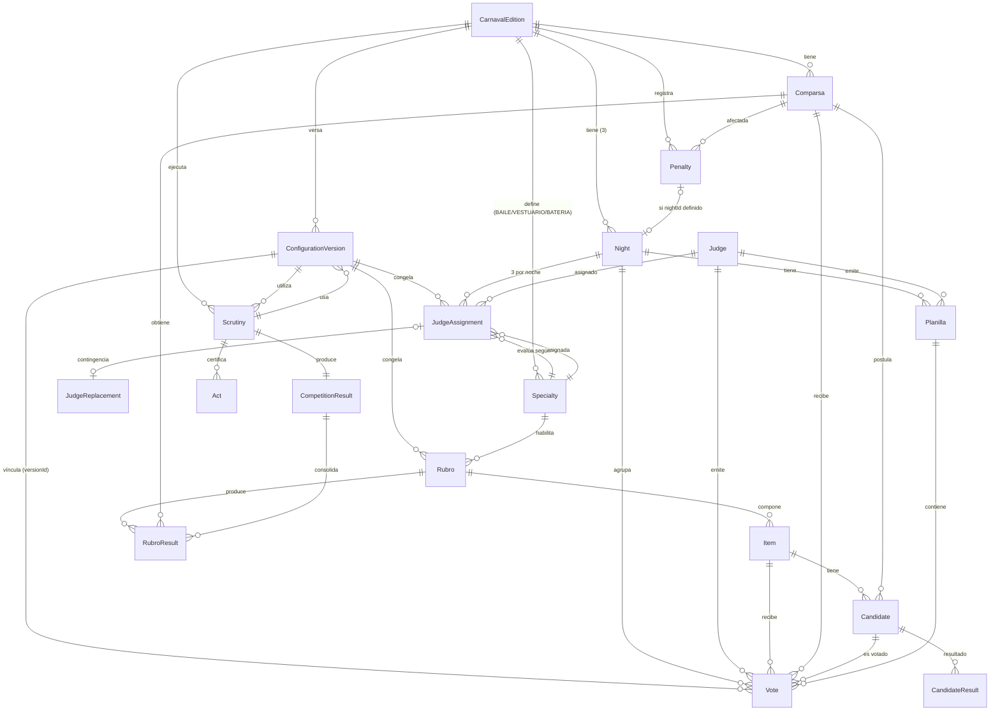
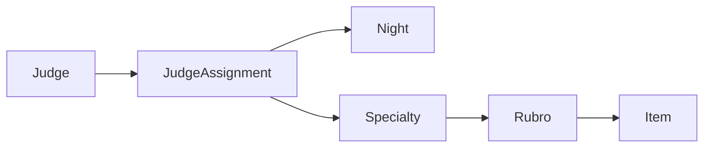
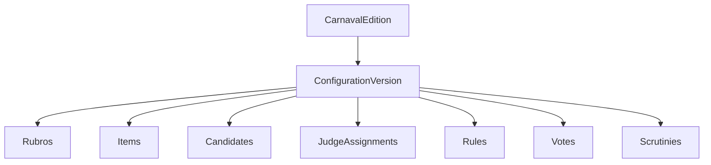
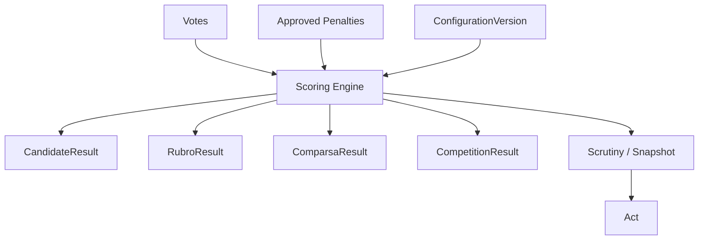

# VOTACIONES2027 — MODELO DE DOMINIO OFICIAL

**Sistema de Votación Digital — Carnavales Goya 2027**

| | |
| --- | --- |
| **Versión** | 1.1 |
| **Estado** | Revisado / Listo para diseño de datos |
| **Alcance** | Modelo conceptual de dominio (no implementado en DB/ORM/API) |
| **Fuente primaria de verdad** | `docs/product/REGLAS-MVP-2027.md` |

> Este documento define el **modelo de dominio conceptual** del sistema. No es un esquema
> PostgreSQL ni una implementación. Debe ser la base acordada para derivar posteriormente
> el modelo de datos, la API, el frontend y la sincronización offline.

---

## 1. Objetivo

Definir y documentar el modelo de dominio del Sistema de Votación Digital de Carnavales
Goya 2027: las entidades del negocio, sus atributos, relaciones, estados, invariantes y
fuentes de verdad, de modo que la implementación posterior (PostgreSQL → API → Frontend →
Offline Sync → Auditoría) derive de un contrato conceptual estable y verificable contra las
reglas cerradas.

---

## 2. Alcance

**Incluye**:

- Modelo conceptual de entidades y sus relaciones.
- Estados de los objetos del dominio (voto, planilla, escrutinio).
- Inmutabilidad y fuentes de verdad (primarias vs derivadas).
- Configuración y congelamiento/versado de la competencia.
- Auditoría y eventos.
- Escrutinio y cálculo de resultados.
- Empates (candidato y comparsa).
- Consideraciones offline-first a nivel de dominio.
- Matriz de invariantes.
- Reglas oficiales vs decisiones técnicas.

**NO incluye** (expresamente fuera del alcance de esta etapa):

- PostgreSQL/SQL, migraciones, Prisma/Drizzle/ORM.
- Endpoints REST/GraphQL.
- Autenticación.
- React/frontend.
- IndexedDB/Service Worker/sincronización real.
- Generación de PDF/actas.
- Implementación funcional nueva en el scoring engine (solo se corrigió una inconsistencia
  detectada en la auditoría previa, ya consolidada en el código).

---

## 3. Fuentes consultadas

1. `docs/product/REGLAS-MVP-2027.md` — FUENTE DE VERDAD FUNCIONAL.
2. `docs/product/PENDIENTES.md` — decisiones abiertas.
3. `packages/scoring-engine/src/*` — implementación actual del cálculo.
4. `packages/shared-types/src/*` — contratos de tipos compartidos ya existentes.
5. `README.md` — contexto arquitectónico previsto.

---

## 4. Reglas de negocio relevantes (cerradas)

### 4.1 Competencia

- Exactamente **3 noches de votación** (§2.1, PEND-001 CERRADO).
- **9 jueces** totales; **3 por noche** (§3.1).
- Cada noche: exactamente un juez por especialidad `BAILE | VESTUARIO | BATERIA` (§3.1).
- La asignación juez/noche/especialidad la determina el **servidor**, nunca el frontend (§3.2).
- Debe poder auditarse quién fue asignado a qué noche y especialidad.

### 4.2 Votación

- Un voto identifica, como mínimo: `juez, noche, comparsa, rubro, ítem, candidato`.
- La combinación `(judge, night, comparsa, rubro, item, candidate)` es **única** (no duplicados).
- El voto confirmado es **inmutable** en operación normal (§10, §22).

### 4.3 Escala

- Notas válidas `0..10` (§7).
- `0` = no presentado; `1..5` reconocimiento; `6` regular; `7` bueno; `8` muy bueno;
  `9` distinguido; `10` sobresaliente.
- Si un ítem obligatorio omitido por el juez → nota efectiva `5`, pero se conserva la
  procedencia (`JUDGE` vs `OMISSION_CORRECTION`) y es auditable (§7, §8).

### 4.4 Cómputo

- **No existe descarte** de nota alta/baja, ni de noches, ni de jueces (§9, §22).
- `TOTAL = NOCHE_1 + NOCHE_2 + NOCHE_3` (§9).

### 4.5 Rubros

- Rubros **nominativos** → participan en Comparsa Ganadora (§5.1, §15).
- Rubros **aleatorios** → NO participan en Comparsa Ganadora, pero conservan su ganador
  individual, auditoría, estadísticas y actas (§5.2).

### 4.6 Múltiples candidatos

Dentro de `comparsa + rubro + ítem` con varios candidatos (regla CERRADA):

1. Calcular el total de cada candidato = suma de sus 3 noches.
2. Identificar el mayor total.
3. Solo el candidato de mayor total contribuye a Comparsa Ganadora.
4. Los demás candidatos no se eliminan: permanecen auditables e históricos (§15).

> El MAX se aplica sobre el **TOTAL del candidato en 3 noches**, no sobre una noche
> individual. Ejemplo: A = 10+6+6 = 22, B = 8+8+8 = 24 → seleccionado B. No se suma A+B.

### 4.7 Empate entre candidatos

El reglamento **no define** un desempate entre dos candidatos del mismo rubro/ítem con igual
total. Por lo tanto:

- NO seleccionar por `candidateId`;
- NO usar orden alfabético;
- NO inventar una regla de desempate.

El dominio debe **representar el empate como pendiente**, conservar todos los candidatos
empatados y ser auditable. Es una **decisión pendiente de negocio**, no una regla oficial.

### 4.8 Comparsa Ganadora

- Usa únicamente rubros nominativos.
- Desempate (orden): 1) mayor cantidad de rubros nominativos ganados; 2) ganador de
  Mejor Batería; 3) sorteo (§16). El mecanismo oficial del sorteo está pendiente → **PEND-102**.

### 4.9 Penalizaciones

- Almacenadas **separadas** de las notas artísticas (§13).
- Nunca modificar el voto original.
- Se conservan: registrador, motivo, fundamento (articulo/regla), monto, comparsa, fecha/hora,
  estado, evidencia.
- Debe auditarse exactamente qué penalizaciones se aplicaron.

### 4.10 Escrutinio

Flujo: votación → cierre de planillas → custodia → lectura de informes del Comisario →
determinación de penalizaciones → aplicación de descuentos → lectura/cálculo de notas →
resultados → certificación/acta (§14).

Los resultados del escrutinio son **derivados**, no la fuente primaria de verdad (§17, §20).

---

## 5. Contextos / áreas del dominio

| Contexto | Descripción |
| --- | --- |
| **Configuración** | Competencia, noches, jueces, especialidades, comparsas, rubros, ítems, candidatos, reglas, asignaciones. Congelamiento/versado. |
| **Votación** | Planillas, votos, escala, omisiones, confirmación, inmutabilidad. |
| **Asignación de jueces** | Definida por el servidor; auditable; reemplazos. |
| **Penalizaciones** | Registro, aprobación, aplicación separada del puntaje. |
| **Escrutinio / Cálculo** | Totales por candidato, por rubro, ganadores, ranking, Comparsa Ganadora, desempates. |
| **Auditoría** | Eventos de auditoría inmutables, corrección por omisión, actas. |
| **Sincronización / Offline** | Identidad, idempotencia, orden temporal, conflictos, confirmación del servidor. |

---

## 6. Entidades

Lista y responsabilidad de cada entidad. Se alinean con el código existente
(`shared-types` y `scoring-engine`) para las que ya existen.

### 6.1 CarnavalEdition (Competencia / Edición)

Abarca la edición Carnavales Goya 2027.

- Atributos: `id`, `code`, `name`, `votingNights` (= 3), `startsOn?`, `endsOn?`.
- Responsabilidad: contexto raíz que contiene noches, comparsas, rubros, configuración.
- Fuente: primaria (configuración oficial).

### 6.2 Night (Noche)

- Atributos: `id`, `editionId`, `number` (1..3), `date?`, `status` (`PLANIFICADA|ABIERTA|CERRADA`).
- Invariante: la competencia tiene exactamente 3 noches.

### 6.3 Judge (Juez)

- Atributos: `id`, persona (usuario), no participa directamente como voto; se asigna vía `JudgeAssignment`.
- Responsabilidad: actor que emite votos dentro de su especialidad/noche.

### 6.4 Specialty (Especialidad)

- Atributos conceptuales: `id`, `code` (`BAILE | VESTUARIO | BATERIA`), `name`, `orderIndex`.
- Responsabilidad: es un **criterio de evaluación** invariante de la competencia. No es una
  entidad dependiente de una noche concreta; es el conjunto cerrado de especialidades oficiales.
- Relación con rubros: cada `Rubro` pertenece a una `Specialty` (por ejemplo, "Mejor Batería"
  es un rubro de especialidad BATERIA, "Vestuario" de VESTUARIO, "Baile" de BAILE). Por tanto
  *¿con qué criterio puede votar un juez?* se deriva de su `Specialty` asignada, y el rubro/ítem
  que evalúa debe pertenecer a esa misma `Specialty`.
- No se inventan especialidades nuevas: el conjunto es cerrado (BAILE, VESTUARIO, BATERIA).

### 6.5 JudgeAssignment (Asignación de juez)

- Atributos: `id`, `judgeId`, `nightId`, `specialtyId`, `confirmed`, `assignedBy`, `assignedAt`.
- Invariantes: 3 jueces por noche; 1 juez por especialidad por noche; el juez no puede votar
  fuera de su especialidad (§3.2).
- La relación de evaluación es:
  `Judge 1───* JudgeAssignment  *───1 Specialty  1───* Rubro 1───* Item`.
  La asignación vincula a un **juez**, una **noche** y una **especialidad**; a partir de esa
  especialidad se determina el conjunto de rubros/ítems que ese juez puede votar (§8).
- Es auditable y puede registrar un `JudgeReplacement` (jurado_original, jurado_reemplazante,
  especialidad, noche, motivo, usuario_autorizante, fecha_hora) (§12). La sustitución crea una
  nueva asignación válida para la noche/especialidad sin tocar los votos ya confirmados.

### 6.6 Comparsa

- Atributos: `id`, `editionId`, `code`, `name`.
- Responsabilidad: entidad evaluada.

### 6.7 Rubro

- Atributos: `id`, `editionId`, `specialtyId`, `name`, `type` (`NOMINATIVO|ALEATORIO`).
- La **diferencia nominativo/aleatorio** queda representada por `type` (§5).
- Pertenece a una `Specialty`; sólo un juez con esa especialidad asignada puede evaluar sus
  ítems (§6.4).

### 6.8 Item (Ítem)

- Atributos: `id`, `rubroId`, `name`, `orderIndex`.
- Unidad de evaluación por debajo del rubro.

### 6.9 Candidate (Candidato)

- Atributos: `id`, `itemId`, `comparsaId`, `label`.
- Puede haber varios candidatos por `(compasa, rubro, item)` → regla de múltiples candidatos.

### 6.10 Vote (Voto)

- Atributos: `id`, `judgeId`, `nightId`, `comparsaId`, `rubroId`, `itemId`, `candidateId`,
  `score`, `scoreSource` (`JUDGE|OMISSION_CORRECTION`), `idempotencyKey`,
  `versionId` (configuración vigente), `syncState`, `deviceContext?`, `confirmedAt?`.
- Identidad: `(judge, night, comparsa, rubro, item, candidate)` → único.
- Es la **fuente primaria** de verdad para el cálculo.
- `scoreSource` distingue nota real de corrección por omisión (§7).
- `versionId` asocia el voto a la `ConfigurationVersion` congelada vigente al confirmarse (§13).
- El voto expone **tres preocupaciones distintas** que no deben confundirse (§10):
  1. **Estado de negocio del voto**: `DRAFT | CONFIRMED | REJECTED` (propuesto; ver §10).
  2. **Confirmación operativa**: `confirmedAt` (momento en que se inmuta).
  3. **Estado técnico de sincronización**: `syncState` (`PENDING | SYNCED | FAILED`), que NO es
     estado de negocio.

### 6.11 Penalty (Penalización)

- Atributos: `id`, `editionId`, `comparsaId`, `nightId?`, `motivo`, `reglaArticulo`,
  `cantidad`, `evidencia?`, `estado` (`PENDIENTE_APROBACION|APROBADA|RECHAZADA`),
  `registeredBy`, `approvedBy?`.
- Alcance (interpretación del campo opcional `nightId?`): el reglamento identifica una
  penalización por `comparsa` **y** `noche` (§13). Por tanto:
  - `nightId` **presente** → penalización aplicada al total de **esa noche** de la comparsa.
  - `nightId` **ausente** → penalización aplicada a nivel de **comparsa** (resultado global).
  La semántica exacta de cálculo de ambos casos, y si el reglamento los admite ambos por igual,
  queda **pendiente de confirmación de negocio** (§22); no se inventan nuevos tipos de
  penalización.
- El cálculo (`totals.ts`) ya separa `totalSinPenalizaciones` / `penalizacionTotal`, por lo que
  cualquier interpretación de alcance es compatible sin reescribir la nota original.
- Se conserva **separada** del voto y del puntaje artístico (§13).
- Invariante: solo `APROBADA` se aplica al cálculo (ya implementado en `totals.ts`).
- Trazabilidad: `registeredBy`, `approvedBy`, evidencia y artefacto de reglamento quedan
  registrados de forma auditable (§14).

### 6.12 Planilla

- Atributos: `id`, `judgeId`, `nightId`, `status`, `confirmedAt?`, `closedAt?`.
- Estados: `BORRADOR → EN_EVALUACION → CONFIRMADA → SINCRONIZADA → CERRADA` (§21).
- Una planilla confirmada no regresa a `BORRADOR`.

### 6.13 Scrutiny (Escrutinio)

- Estados: `NO_INICIADO | EN_PROCESO | CERTIFICADO`.
- Contiene: referencia a `ConfigurationVersion` (configuración utilizada) + snapshot de entrada
  (votos + penalizaciones aprobadas) + resultados + tratamiento de desempates + certificación.
- Es reproducible y reconstruible contra la `ConfigurationVersion` congelada (§16).

### 6.14 Resultados derivados

Estas entidades son **derivadas** (nunca primarias):

- `RubroResult`: `rubroId`, `comparsaId`, `total`.
- `CandidateResult`: total por candidato (3 noches), `selected`.
- `CompetitionResult`: ranking, `winnerComparsaId`, `tieBreaks`.
- `RubroComputation` del engine: `totalSinPenalizaciones`, `penalizacionTotal`, `total`,
  `byNight`, `pendingTies`, `hasPendingCandidateTie`.

### 6.15 AuditEvent (Evento de auditoría)

- Entidad **transversal** que audita cualquier entidad del dominio (no sólo votos). Un voto
  puede tener **múltiples** eventos; la relación es 1:N (un evento → una entidad), nunca la
  inversa ni 1:1 obligatoria (§14).
- Atributos mínimos: `id`, `entityType`, `entityId`, `eventType`, `actorId`,
  `occurredAt` (timestamp), `payload/metadata` (estado antes / estado después / contexto).
- Respuestas que debe dar: `QUÉ` (eventType + payload), `QUIÉN` (actorId), `CUÁNDO`
  (occurredAt), `SOBRE QUÉ` (entityType + entityId), estado antes/después (payload).
- Registra, entre otros: creación de voto, corrección por omisión, confirmación,
  intento de modificación, rechazo, sincronización, conflicto, cierre de planilla,
  reemplazo de juez, penalización, aprobación, escrutinio, certificación, generación de acta.
- **APPEND-ONLY / INMUTABLE**: los eventos sólo se agregan; nunca se editan ni eliminan (§19).
- A diferencia del modelo previo (`Vote → AuditEvent` 1:1), aquí `AuditEvent → entityType /
  entityId` permite auditar `Night`, `JudgeAssignment`, `Specialty`, `Rubro`, `Planilla`,
  `Penalty`, `Vote`, `Scrutiny`, `ConfigurationVersion` y `Act` con la misma estructura.

### 6.16 Act (Acta)

- Entidad derivada del escrutinio certificado; describe el resultado oficial y sus firmantes.
- Atributos conceptuales: `id`, `scrutinyId`, `competitionId`, `generatedAt`, `generatedBy`,
  `contenido/estadísticas`, `firma?`.
- La firma digital certificada queda fuera del MVP (decisión jurídica posterior, §18, PEND-005).

### 6.17 ConfigurationVersion (Versión de configuración / snapshot)

Entidad que congela la configuración exacta de la competencia en un momento dado, para poder
reconstruir cualquier voto/escrutinio de forma histórica.

- Atributos: `id`, `editionId`, `version` (entero secuencial), `status`
  (`BORRADOR | CONGELADA`), `frozenAt?`, `frozenBy?`, `rulesRef` (referencia a
  `CARNAVAL_2027_RULES`), `contentRef` (referencia inmutable a: rubros, ítems, candidatos,
  asignaciones de jueces, noches, comparsas).
- **Momento de congelamiento**: al **iniciar la competencia / primera votación confirmada**.
  Antes de ese momento la versión es `BORRADOR` y puede modificarse; una vez `CONGELADA`, ya no
  se modifica (se crea una versión nueva `N+1` si se requiere un cambio controlado).
- **Relación con votos**: cada `Vote.versionId` apunta a la versión congelada vigente en el
  momento de su confirmación → responde "¿con qué configuración se generó este voto?" (§17).
- **Relación con escrutinio**: cada `Scrutiny.snapshotReference` apunta a la
  `ConfigurationVersion` + votos + penalizaciones sobre las que se calcula (§16).
- **Reconstrucción histórica**: para reconstruir un escrutinio pasado bastan la versión
  congelada + los votos/penalizaciones vinculados a ella; no se re-escribe nada.
- Comportamiento ante modificación: un intento de modificar una versión `CONGELADA` se
  **rechaza** y se registra como evento de auditoría; si la competencia ya inició y es
  necesario un cambio, se crea una versión nueva (que no afecta votos/escrutinios previos).
- No se diseña aquí el mecanismo técnico del snapshot; se documenta el concepto (§20).

### 6.18 Entidades fusionadas / no separadas (justificación)

- **Judge** no se separa de la persona/usuario aquí: la asignación es lo relevante para el
  dominio de votación; los roles de acceso se manejan en contexto de autenticación.
- **Act** es una entidad de salida derivada, no un agregado de votos.

---

## 7. Atributos conceptuales

Los atributos por entidad están enumerados en §6. Se preserva la nomenclatura que ya existe
en `packages/shared-types` para evitar divergencia:

| Entidad | Atributos clave (conceptuales) |
| --- | --- |
| CarnavalEdition | id, code, name, votingNights, startsOn?, endsOn? |
| Night | id, editionId, number, date?, status |
| Judge | id |
| Specialty | id, code, name, orderIndex |
| JudgeAssignment | id, judgeId, nightId, specialtyId, confirmed, assignedBy, assignedAt |
| JudgeReplacement | id, nightId, originalJudgeId, replacementJudgeId, specialty, reason, authorizedBy, occurredAt |
| ConfigurationVersion | id, editionId, version, status, frozenAt?, frozenBy?, rulesRef, contentRef |
| Comparsa | id, editionId, code, name |
| Rubro | id, editionId, specialtyId, name, type |
| Item | id, rubroId, name, orderIndex |
| Candidate | id, itemId, comparsaId, label |
| Vote | id, judgeId, nightId, comparsaId, rubroId, itemId, candidateId, score, scoreSource, idempotencyKey, versionId, syncState, deviceContext?, confirmedAt? |
| Penalty | id, editionId, comparsaId, nightId?, motivo, reglaArticulo, cantidad, evidencia?, estado, registeredBy, approvedBy? |
| Planilla | id, judgeId, nightId, status, confirmedAt?, closedAt? |
| Scrutiny | id, editionId, snapshotReference, status, executedBy, executedAt, result |
| RubroResult | rubroId, comparsaId, total |
| CandidateResult | comparsaId, rubroId, itemId, candidateId, total, selected |
| CompetitionResult | ranking, winnerComparsaId?, tieBreaks |
| AuditEvent | id, entityType, entityId, eventType, actorId, occurredAt, deviceContext?, payload |
| Act | id, scrutinyId, competitionId, generatedAt, generatedBy, contenido, firma? |

---

## 8. Relaciones

```
CarnavalEdition      1───* Night
CarnavalEdition      1───* Comparsa
CarnavalEdition      1───* Specialty
CarnavalEdition      1───* ConfigurationVersion     (versado)
CarnavalEdition      1───* Scrutiny
CarnavalEdition      1───0..1 Act                    (certificado final)

ConfigurationVersion  *───1 CarnavalEdition
ConfigurationVersion  1───* Rubro
ConfigurationVersion  1───* Item                (vía rubro)
ConfigurationVersion  1───* Candidate           (vía ítem)
ConfigurationVersion  1───* JudgeAssignment     (asignaciones congeladas)
ConfigurationVersion  1───* Night
ConfigurationVersion  1───* Vote                (votos confirmados vinculados por versionId)
ConfigurationVersion  1───* Scrutiny            (escrutinios que la utilizaron)
ConfigurationVersion  1───1 Rules               (CARNAVAL_2027_RULES)

Night            1───* JudgeAssignment
Night            1───* Planilla
Night            1───* Vote

Judge            1───* JudgeAssignment
Judge            1───* Planilla
Judge            1───* Vote
JudgeAssignment  1───0..1 JudgeReplacement       (contingencia)

JudgeAssignment  *───1 Judge
JudgeAssignment  *───1 Night
JudgeAssignment  *───1 Specialty
Specialty        1───* Rubro                    (habilita rubros evaluables)
Specialty        1───* JudgeAssignment

Rubro           1───* Item
Rubro           1───* Vote
Rubro           1───* RubroResult               (derivado)

Item            1───* Candidate
Item            1───* Vote

Comparsa        1───* Candidate
Comparsa        1───* Vote
Comparsa        1───* Penalty
Comparsa        1───* RubroResult               (derivado)

Candidate       1───* Vote
Candidate       1───1 CandidateResult           (derivado)

Vote            *───1 Planilla                 (lógicamente agrupados)
Vote            *───1 ConfigurationVersion     (versionId)

Penalty         *───1 Comparsa
Penalty         *───0..1 Night                 (si nightId presente → penalización por noche)

Scrutiny        1───1 ConfigurationVersion     (configuración utilizada)
Scrutiny        1───1 CompetitionResult        (derivado)
Scrutiny        1───1 Act                      (certificación)
Scrutiny        1───0..1 ConfigurationSnapshot (entrada: configuración + votos + penalizaciones)

AuditEvent      *───N entity                   (transversal: entityType + entityId)
```

Nota: `AuditEvent` no mantiene una relación 1:1 con `Vote`. Es una capa **transversal** que se
referencia a cualquier entidad mediante `entityType + entityId`, por lo que un voto (o planilla,
juez, penalización, escrutinio, etc.) puede tener múltiples eventos de auditoría (§14).

---

## 9. Cardinalidades

| Relación | Cardinalidad | Justificación |
| --- | --- | --- |
| CarnavalEdition → Night | 1:N | 3 noches por competencia. |
| CarnavalEdition → Judge | 1:N (9) | 9 jueces totales. |
| CarnavalEdition → Specialty | 1:N (3) | Especialidades BAILE/VESTUARIO/BATERIA. |
| CarnavalEdition → ConfigurationVersion | 1:N (versado) | Múltiples versiones; la vigente se congela al iniciar. |
| ConfigurationVersion → Rubro/Item/Candidate/JudgeAssignment | 1:N | Contenido congelado para reconstrucción. |
| ConfigurationVersion → Vote | 1:N | Votos vinculados por `versionId`. |
| ConfigurationVersion → Scrutiny | 1:N | Escrutinios que la utilizaron. |
| Night → JudgeAssignment | 1:N (3) | 3 jueces por noche. |
| Judge → JudgeAssignment | 1:N | Un juez puede asignarse a distintas noches (diferentes especialidades/noches). |
| JudgeAssignment → Specialty | N:1 | Cada asignación fija la especialidad del juez esa noche. |
| Specialty → Rubro | 1:N | La especialidad habilita qué rubros puede evaluar el juez. |
| JudgeAssignment → Rubro/Item | (derivada) | Un juez sólo evalúa rubros/ítems de su especialidad asignada. |
| Rubro → Item | 1:N | Un rubro tiene varios ítems. |
| Item → Candidate | 1:N | Varios candidatos por ítem posible. |
| Candidate → Vote | 1:N | Un candidato es votado en N noches. |
| Vote → (judge,night,comparsa,rubro,item,candidate) | único | Identidad del voto; no duplicados. |
| Comparsa → Penalty | 1:N | Varias penalizaciones por comparsa. |
| Penalty → Night | 0..1 | Presente si `nightId` está definido (penalización por noche); si ausente, nivel comparsa. |
| Scrutiny → ConfigurationVersion | N:1 | Qué configuración utilizó el escrutinio. |
| Scrutiny → RubroResult | 1:N | Resultados derivados por rubro/comparsa. |
| Scrutiny → CompetitionResult | 1:1 | Clasificación final. |
| Scrutiny → Act | 1:1 | Acta certificada por escrutinio. |
| AuditEvent → entity | N:0..*(transversal) | `entityType + entityId`; múltiples eventos por entidad. |

---

## 10. Estados

Es fundamental distinguir **tres preocupaciones de estado distintas** que no deben confundirse
ni duplicarse como máquinas de estados redundantes:

1. **Estado de negocio del voto** (`Vote.status`): `DRAFT | CONFIRMED | REJECTED`.
2. **Estado operativo de la planilla**: `BORRADOR → EN_EVALUACION → CONFIRMADA → SINCRONIZADA →
   CERRADA`.
3. **Estado técnico de sincronización** (`syncState`): `PENDING | SYNCED | FAILED` — NO es
   estado de negocio y no redefine la regla de negocio.

### Voto

| Estado | Modificable | Confirmable | Inmutable | Anulable | Rechazable |
| --- | --- | --- | --- | --- | --- |
| `DRAFT` | Sí | Sí | No | Sí | No |
| `CONFIRMED` | No | — | Sí | No (requiere nuevo evento) | No |
| `REJECTED` | No | No | Sí | No | Sí |

- Un voto `CONFIRMED` es inmutable en operación normal (§10, §22).
- Cualquier modificación excepcional se representa con **un nuevo evento/registro auditable**,
  nunca con modificación destructiva del original.

> **¿`Vote.status` es necesario?** El estado de confirmación ya es derivable de `confirmedAt`
> (voto confirmado ⇔ `confirmedAt != null`) y de eventos `VOTE_CONFIRMED`, y la inmutabilidad
> se refuerza a nivel de planilla. `DRAFT`/`REJECTED` sólo añaden semántica cuando un voto aún
> no está integrado en una planilla confirmada. Por no duplicar máquinas de estado, el modelo
> conceptual propone mantener `Vote.status` como **derivado/opcional** (`CONFIRMED` ⇔
> `confirmedAt`), usando `DRAFT/REJECTED` sólo cuando aportan información no capturada por
> planilla/`confirmedAt`. Se deja como **decisión de modelado a consensuar** (ver §Pendientes)
> si se persiste como campo o se deriva; no se contradicen las reglas cerradas en ningún caso.

### Planilla

```
BORRADOR → EN_EVALUACION → CONFIRMADA → SINCRONIZADA → CERRADA
```

- Una planilla confirmada **no** regresa a `BORRADOR` (§21). Estados ya presentes en
  `shared-types/planilla.ts`.
- La planilla es el **flujo operativo/documental** de una evaluación; no sustituye al estado de
  negocio del voto ni al `syncState`.

### Escrutinio

```
NO_INICIADO → EN_PROCESO → CERTIFICADO
```

- `NO_INICIADO`: aún no se ejecutó.
- `EN_PROCESO`: se está calculando/revisando (penalizaciones, resultados).
- `CERTIFICADO`: resultado final certificado (se puede generar el acta).
- Cada estado tiene razón funcional (control de flujo y de certificación); no se añaden
  estados sin justificación.

### Resumen de separación

| Preocupación | Estado | Naturaleza |
| --- | --- | --- |
| Voto (dato evaluado) | `DRAFT/CONFIRMED/REJECTED` (derivable vía `confirmedAt`) | Negocio |
| Planilla (flujo operativo) | `BORRADOR...CERRADA` | Operativo / documental |
| Sincronización (transporte) | `PENDING/SYNCED/FAILED` | Técnico |

---

## 11. Inmutabilidad

Principios (alineados con §10, §17, §22):

- Los **votos originales** nunca se modifican ni se eliminan.
- La **corrección por omisión** ($5) es un valor derivado con `scoreSource =
  OMISSION_CORRECTION`; no altera el voto (que no existe si hubo omisión) y queda auditada.
- Las **notas artísticas** y las **penalizaciones** son valores separados; el resultado se
  computa a partir de ambos sin tocar ninguno.
- Los **candidatos no seleccionados** no se eliminan: permanecen para auditoría e historia.
- El **scoring engine** ya respeta esto: `votes` se recorren de forma inmutable y solo se
  producen valores derivados (`CandidateResolution`, `RubroComputation`).

---

## 12. Fuentes de verdad

### Datos primarios (fuente de verdad)

- `ConfigurationVersion` congelada (configuración versionada).
- Votos (vinculados a su `versionId`).
- Asignaciones de jueces (y reemplazos).
- Penalizaciones aprobadas (con su alcance explícito).
- Evidencias.
- Eventos de auditoría (append-only).

### Datos derivados (nunca primarios)

- Total por candidato.
- Total por rubro.
- Ganador de rubro.
- Cantidad de rubros ganados.
- Clasificación (ranking).
- Resultado de Comparsa Ganadora.

El modelo impide confundir un resultado calculado con una nota original: los resultados son
entidades/estructuras separadas (`RubroResult`, `CandidateResult`, `CompetitionResult`,
`RubroComputation`) y nunca se escriben sobre votos o notas.

---

## 13. Configuración y congelamiento (versado)

Se modela mediante la entidad **`ConfigurationVersion`** (§6.17).

- La configuración **crítica** que necesita versado al iniciar la competencia:
  comparsas, jueces, noches, especialidades, rubros, ítems, candidatos, reglas aplicables,
  asignaciones (`CARNAVAL_2027_RULES`).
- Cada **voto** se asocia por `versionId` a la `ConfigurationVersion` congelada vigente en el
  momento de su confirmación → responde "¿con qué configuración se generó este voto?".
- **Congelamiento**: al iniciar la competencia (primera votación confirmada) la versión pasa de
  `BORRADOR` a `CONGELADA`. A partir de ahí no se modifica; un cambio controlado crea una
  `N+1` nueva sin alterar votos/escrutinios previos.
- Si una configuración cambia posteriormente, los votos e históricos no se re-escriben:
  el escrutinio debe poder **reconstruirse** contra la versión congelada correspondiente
  (§20 "no mutación del resultado").
- Cualquier intento de modificar una versión `CONGELADA` se **rechaza** y se registra como
  evento de auditoría.
- No se diseña aquí el mecanismo técnico del snapshot; se documenta el concepto y el requisito.

Estas entidades quedan bajo la versión congelada, tal como exige la reconstrucción histórica:

```text
CarnavalEdition
   |
   v
ConfigurationVersion
   |
   +-- Rubros
   +-- Items
   +-- Candidates
   +-- JudgeAssignments
   +-- Rules
   |
   +-- Votes
   |
   +-- Scrutinies
```

---

## 14. Auditoría

`AuditEvent` funciona como capa **transversal** de trazabilidad (§6.15, §19).

- Es `APPEND-ONLY` e **inmutable**: sólo se agrega, nunca se edita ni elimina.
- Es multi-entidad: audita `Night`, `JudgeAssignment`, `Specialty`, `Rubro`, `Item`,
  `Candidate`, `Planilla`, `Penalty`, `Vote`, `ConfigurationVersion`, `Scrutiny`, `Act`
  mediante `entityType` + `entityId`. Un voto puede tener **varios** eventos (1:N); no existe
  la relación 1:1 `Vote → AuditEvent` del modelo anterior.

Atributos mínimos: `id`, `entityType`, `entityId`, `eventType`, `actorId`, `occurredAt`,
`payload/metadata`.

Eventos considerados (§19 / §6.15): creación de voto, corrección por omisión, confirmación,
intento de modificación, rechazo, sincronización, conflicto, cierre de planilla, reemplazo de
juez, penalización, aprobación, escrutinio, certificación, generación de acta,
asignación/reemplazo de juez, contingencia administrativa.

El modelo responde a:

```
QUÉ ocurrió              → eventType + payload
QUIÉN lo hizo            → actorId
CUÁNDO ocurrió           → occurredAt
SOBRE QUÉ entidad        → entityType + entityId
QUÉ estado antes         → payload (estado anterior)
QUÉ estado pasó          → payload (estado nuevo)
```

Los eventos de auditoría **no se modifican** por operaciones normales (§19). El mecanismo
criptográfico definitivo queda pendiente (PEND-113 entre otros; no se diseña aquí).

---

## 15. Offline-first desde la perspectiva de dominio

La capa offline (IndexedDB/Service Worker) se implementará más adelante; aquí se documenta
qué necesita el dominio:

### Identidad única del voto

- `id` único del voto, estable y generable en el cliente (UUID) para idempotencia.

### Idempotencia

- `idempotencyKey` garantiza que un mismo voto reenviado no se duplica (ya presente en `Vote`).

### Orden temporal

- Timestamps por voto/planilla para reconstruir el orden de eventos.

### Trazabilidad

- `deviceContext` (deviceId, platform, sessionId, userAgent) en cada voto.

### Sincronización / conflictos / duplicados

- `syncState` (`PENDING|SYNCED|FAILED`) distingue el estado de sincronización.
- Al sincronizar, el servidor valida contra `(judge, night, comparsa, rubro, item, candidate)`
  para rechazar duplicados y confirmar (`VOTE_CONFIRMED`).

### Confirmación del servidor

- El voto se convierte en inmutable al ser confirmado por el servidor (o al confirmarlo la
  planilla, según se decida); la confirmación genera `VOTE_CONFIRMED`.

**Identidad vs sincronización**: la identidad del voto es el par de claves de negocio
(immutable), mientras `syncState` cambia (PENDING→SYNCED) y es una preocupación técnica que no
debe contaminar el núcleo de reglas. Ya se mantienen separadas en `Vote`.

**Tres estados separados (§10)**: el estado de negocio del voto, el estado operativo de la
planilla y `syncState` son tres preocupaciones distintas y ortogonales. La sincronización
(`PENDING → SYNCED`) informa del transporte/confirmación técnica, pero **no redefine** la regla
de negocio ni la semántica de la nota (`score`, `scoreSource`).

---

## 16. Escrutinio

Flujo representable en el dominio (§14):

```
votación → cierre de planillas → custodia → lectura de informes del Comisario →
determinación de penalizaciones → aplicación de descuentos → lectura/cálculo de notas →
resultados → certificación / acta
```

Estados del escrutinio: `NO_INICIADO | EN_PROCESO | CERTIFICADO`.

Cada ejecución de escrutinio:

- Fija un snapshot de entrada (referencia a `ConfigurationVersion` + votos + penalizaciones
  aprobadas).
- Calcula resultados **derivados**.
- Registra eventos `SCRUTINY_EXECUTED`, `TIE_BREAK_RESOLVED`, `ACTA_GENERATED`.
- Es reproducible: mismos datos + misma `ConfigurationVersion` → mismo resultado (§20).
- La `ConfigurationVersion` del escrutinio permite reconstruir el resultado histórico
  independientemente de modificaciones futuras de configuración.

---

## 17. Cálculo de resultados

Pipeline (alineado con `packages/scoring-engine`):

1. **Candidato**: total = suma de las 3 noches (por candidato).
2. **Múltiples candidatos**: seleccionar `MAX(TOTAL_CANDIDATO)`; conservar el resto (audit).
3. **Rubro**: sumar los ítems por noche; `TOTAL_RUBRO = N1 + N2 + N3` (sin descarte).
4. **Penalización**: aplicar solo penalizaciones `APROBADA`; el resultado se separa en
   `totalSinPenalizaciones`, `penalizacionTotal`, `total`.
5. **Ganador de rubro**: mayor total (puede haber empate de comparsas → múltiples ganadores).
6. **Comparsa Ganadora**: solo rubros nominativos; ranking por total; desempates (ver §18).

Se conserva la procedencia (`JUDGE` / `OMISSION_CORRECTION`) y la separación
artístico/penalización.

---

## 18. Empates

### Empate entre candidatos (del mismo rubro/ítem)

El reglamento no define desempate → **decisión pendiente**. El dominio debe:

- Representar el empate explícitamente.
- Conservar todos los candidatos empatados.
- NO seleccionar por `candidateId` ni alfabético.

El scoring engine ya lo representa: `selectionReason = CANDIDATE_MAX_TIE`,
`selectedCandidateId = undefined`, `tiedCandidateIds` presente, y el rubro marca
`pendingTies`/`hasPendingCandidateTie` (ítem no contado en el total). Este comportamiento se
documenta como **decisión técnica** (representación explícita), no como regla del reglamento.

### Empate entre comparsas (desempate final)

Orden (obligatorio, §16):

1. Mayor cantidad de rubros nominativos ganados.
2. Ganador de Mejor Batería.
3. Sorteo (pendiente → **PEND-102**, sin mecanismo inventado).

---

## 19. Diagramas — Mermaid

### 19.1 ERD principal (evaluación, versado, resultados)



### 19.2 Evaluación por especialidad



La especialidad **habilita** el conjunto de rubros/ítems que el juez puede evaluar esa noche;
no es una relación directa `JudgeAssignment → Rubro`.

### 19.3 Configuración versionada



### 19.4 Pipeline de resultados (fuente vs derivado)



### 19.5 Auditoría transversal

`AuditEvent` es una capa transversal: un evento se referencia a cualquier entidad mediante
`entityType` + `entityId` (relación N:1 por entidad, nunca una relación 1:1 exclusiva con
`Vote`).

---

## 20. Matriz de invariantes

> La matriz completa con todas las invariantes se mantiene en
> `docs/architecture/DOMAIN-INVARIANTS.md` para evitar redundancia en este documento.

Resumen principal:

| Invariante | Tipo | Dónde se garantiza | Consecuencia si falla |
| --- | --- | --- | --- |
| Exactamente 3 noches | Negocio | Dominio/Servidor | Rechazo |
| 9 jueces; 3 por noche | Negocio | Servidor | Rechazo |
| 1 especialidad única por noche | Negocio | Servidor | Rechazo |
| Specialty es entidad separada; habilita rubros del juez | Arquitectura | Modelo | Evaluación fuera de dominio |
| Nota 0..10 | Negocio | Dominio/Servidor | Rechazo |
| Omitido → 5 (con procedencia) | Negocio | Scoring Engine | Corrección no auditable |
| Sin descarte | Negocio | Scoring Engine | Todas las noches cuentan |
| Voto confirmado inmutable | Seguridad | Persistencia/Servidor | Rechazo / no mutación |
| No duplicación de voto | Integridad | Persistencia/Servidor | Rechazo |
| Voto vinculado a ConfigurationVersion | Integridad | Persistencia | Histórico no reconstruible |
| Configuración congelada no se modifica post-inicio | Integridad | Servidor | Datos históricos corrompidos |
| MAX candidato sobre total 3 noches | Negocio | Scoring Engine | Resultado incorrecto |
| Candidatos no seleccionados conservados | Auditoría | Persistencia | Pérdida de trazabilidad |
| Penalización separada + alcance explícito | Seguridad | Persistencia/Modelo | Contaminación de evidencia |
| Penalización aplicada solo si APROBADA | Negocio | Servidor/Scoring | Descuento indebido |
| Rubros nominativos única base de Comparsa Ganadora | Negocio | Scoring Engine | Clasificación incorrecta |
| Auditoría append-only + transversal (entityType/entityId) | Auditoría | Persistencia/Modelo | Trazabilidad corrupta o parcial |
| Empate de candidatos → representado, no resuelto por id | Negocio (pendiente) | Scoring Engine | Regla de negocio inventada |
| Empate final → PEND-102 no inventado | Negocio (pendiente) | Dominio/Servidor | Sorteo falso |

---

## 21. Reglas oficiales vs decisiones técnicas

| Ítem | Regla oficial (reglamento) | Decisión funcional del proyecto | Decisión técnica | Estado |
| --- | --- | --- | --- | --- |
| 3 noches | Sí | — | — | Cerrado |
| Escala 0..10 | Sí | — | — | Cerrado |
| Omitido→5 | Sí | — | `scoreSource=OMISSION_CORRECTION` | Cerrado |
| Sin descarte | Sí | — | — | Cerrado |
| Rubros nominativos en CG | Sí | — | — | Cerrado |
| MAX candidato = total 3 noches | Sí | Decisión funcional MVP | — | Cerrado |
| Candidatos no seleccionados conservados | Sí | — | — | Cerrado |
| Empate candidatos | Reglamento no define | — | Representación explícita (`CANDIDATE_MAX_TIE`) no resolución | **Abierto (decisión pendiente)** |
| Comparsa Ganadora (1→2→3) | Sí | — | — | Cerrado |
| Sorteo final | No define mecanismo | — | — | **PEND-102 Abierto** |
| Specialty como entidad separada | Implícito en reglamento | — | Modelo conceptual: `Specialty` como criterio de evaluación → habilita `Rubro → Item` | **Decisión técnica** |
| JudgeAssignment → Specialty (no → Rubro) | Implícito en reglamento | — | Relación corregida: `JudgeAssignment *───1 Specialty 1───* Rubro` | **Decisión técnica** |
| ConfigurationVersion | No detalla | Requisito reconstrucción | `ConfigurationVersion` con `BORRADOR/CONGELADA`; `Vote.versionId`; modificación posterior crea nueva versión | **Decisión técnica** |
| AuditEvent multi-entidad | Implícito (auditoría) | — | `entityType + entityId`; transversal; `APPEND-ONLY` | **Decisión técnica** |
| Alcance penalizaciones | Reglamento lista `comparsa` + `noche` | — | Interpretación: `nightId` presente → por noche; ausente → nivel comparas | **Pendiente de confirmación** |
| Vote.status (`DRAFT/CONFIRMED/REJECTED`) | No detalla | — | Propuesto como derivado de `confirmedAt`; aún no implementado en `shared-types` | **Decisión pendiente** |
| Firma digital | Posterior | MVP no firma certificada | — | PEND-005 (jurídico) |
| Sincronización offline | No detalla | Offline-first | IndexedDB/SW a implementar | Técnico pendiente |
| Hash de integridad | §18/§20 | Trazabilidad | Placeholder actual | PEND-113 |

---

## 22. Pendientes

### Cerrados

- **Múltiples candidatos (`MAX(TOTAL_CANDIDATO)`)**: **CERRADO**. La regla está implementada y
  auditada; no reaparece como pendiente.

### Abiertos (no bloqueantes)

- **PEND-102 — mecanismo oficial de sorteo (empate final entre comparsas)**: `OPEN`. No se
  inventa. El engine reporta `winnerComparsaId: undefined` con `detail.pending: "PEND-102"`.
- **Empate entre candidatos**: se representa explícitamente como pendiente (no se resuelve por
  `candidateId` ni alfabético). Requiere decisión de negocio futura sobre cómo desempatar.
- **Vote.status explícito** (`DRAFT/CONFIRMED/REJECTED`): propuesto como derivado de
  `confirmedAt` y eventos; `shared-types` actual no tiene campo `status` explícito. Debe
  consensuarse si se agrega o se mantiene derivado.
- **Firma/acta digital certificada**: posterior (§18, PEND-005).
- **Hash/integridad definitivo**: PEND-113.
- **Alcance de penalizaciones preciso**: el reglamento identifica penalizaciones por
  `comparsa` + `noche`; el modelo interpreta `nightId` presente → por noche, ausente → nivel
  comparas. La semántica exacta de cálculo de ambos casos queda **pendiente de confirmación de
  negocio**; `totals.ts` ya separa `totalSinPenalizaciones` / `penalizacionTotal`.

---

## 23. Riesgos / dudas detectadas

1. **Empate entre candidatos (sin decisión)**: bloquea la oficialización del total de un rubro
   cuando ocurre; el engine lo marca (`pendingTies`) pero el negocio debe decidir el desempate.
2. **Vote.status informal**: hoy la inmutabilidad se apoya en planilla (`confirmedAt`) y en
   eventos `VOTE_CONFIRMED`, no en un campo `status` explícito. Riesgo si se requiere
   anular/rechazar votos aislados antes de que estén en planilla — debe consensuarse.
3. **Asignación de jueces**: el motor no valida la cantidad/duración/asignación de jueces;
   esa validación es responsabilidad del servidor. Riesgo si no se implementa en el servidor.
4. **Cambio de configuración post-inicio**: ya mitigado con `ConfigurationVersion`; sin embargo,
   la implementación técnica del snapshot debe reforzarse para asegurar que la reconstrucción
   histórica es efectiva.
5. **Sync/duplicados**: la unicidad `(judge, night, comparsa, rubro, item, candidate)` es la
   defensa central contra duplicados al sincronizar; debe reforzarse en persistencia/servidor.
6. **Alcance de penalizaciones**: el reglamento lista `comparsa` + `noche`; el modelo
   interpreta `nightId` presente → por noche, ausente → nivel comparas. La semántica final de
   cálculo debe confirmarse en negocio antes de PostgreSQL; riesgo si se asume un solo
   alcance en la implementación.
7. **`executedAt` en el escrutinio usa fecha/hora**: solo afecta metadata, no resultados;
   debe quedar claro que el resultado es determinista independiente de la fecha/hora.

---

## 24. Validación

### Estado de coherencia del modelo

- `DOMAIN-MODEL.md` y `DOMAIN-INVARIANTS.md` son coherentes entre sí (§20 ↔ anexo).
- Las entidades, relaciones y cardinalidades son consistentes con `packages/scoring-engine` y
  `packages/shared-types` (sin romper contratos existentes).
- No se modificaron reglas cerradas del reglamento.
- No se inventaron desempates ni mecanismos no contemplados.
- La regla de múltiples candidatos (`MAX(TOTAL_CANDIDATO)`) continúa **cerrada** y no reaparece
  como pendiente. `PEND-102` (sorteo final) continúa abierto.

### Validaciones disponibles (código fuente)

| Validación | Resultado |
| --- | --- |
| Typecheck (`npm run typecheck`) | PASS |
| Tests (`npm test`) | PASS 27/27 |
| Referencia a decisión de múltiples candidatos (cerrada) | 0 (grep exit 1) |
| Compatibilidad scoring-engine | Verificada (entidades: `Vote`, `Penalty`, `CandidateResult`, `RubroComputation`, `tieBreaks`) |
| Compatibilidad shared-types | Verificada (types: `Vote`, `Penalty`, `Planilla`, `AuditEvent`, `Candidate`, `Rubro`, `Item`) |

---

**Fin del documento.**
